# FireISP 5.0 — Entity-Relationship Diagram

> Auto-generated from `database/schema.sql` (101 tables, MySQL 8.0+ / MariaDB 10.6+).
>
> The Mermaid diagram below shows the **~40 most important tables** and their
> foreign-key relationships. Columns are limited to PKs, key FKs, and a handful
> of domain-critical fields to keep the diagram readable.

## ER Diagram

```mermaid
erDiagram
    %% =====================================================================
    %%  CORE — Organizations, Users, Clients, Contacts, Sites
    %% =====================================================================

    organizations {
        bigint id PK
        varchar name
        enum locale "global | MX"
        varchar tax_id
        enum status
    }

    users {
        bigint id PK
        bigint organization_id FK
        varchar first_name
        varchar last_name
        varchar email
        enum role "admin | billing | support | technician"
        enum status
    }

    clients {
        bigint id PK
        bigint organization_id FK
        varchar name
        varchar email
        enum client_type "personal | company"
        enum locale "global | MX"
        varchar tax_id
        enum status
    }

    contacts {
        bigint id PK
        bigint client_id FK
        varchar first_name
        varchar last_name
        varchar email
        varchar role
        tinyint is_primary
    }

    sites {
        bigint id PK
        bigint organization_id FK
        varchar name
        enum site_type "pop | data_center | tower | …"
        decimal latitude
        decimal longitude
        enum status
    }

    organization_users {
        bigint id PK
        bigint organization_id FK
        bigint user_id FK
        enum role
    }

    %% =====================================================================
    %%  SERVICE — Plans, Contracts, Addons
    %% =====================================================================

    plans {
        bigint id PK
        bigint organization_id FK
        varchar name
        int download_speed
        int upload_speed
        decimal price
        enum billing_cycle
        enum status
    }

    plan_addons {
        bigint id PK
        bigint organization_id FK
        varchar name
        decimal price
        enum status
    }

    contracts {
        bigint id PK
        bigint client_id FK
        bigint plan_id FK
        bigint site_id FK
        bigint created_by FK
        date start_date
        date end_date
        decimal price_override
        enum connection_type
        enum status
    }

    contract_addons {
        bigint id PK
        bigint contract_id FK
        bigint plan_addon_id FK
        decimal price_override
    }

    sla_definitions {
        bigint id PK
        bigint plan_id FK
        decimal uptime_pct
        int response_time_min
    }

    %% =====================================================================
    %%  BILLING — Invoices, Payments, Credit Notes, Billing Periods
    %% =====================================================================

    invoices {
        bigint id PK
        bigint client_id FK
        bigint contract_id FK
        bigint created_by FK
        varchar invoice_number
        date issue_date
        date due_date
        decimal subtotal
        decimal tax_amount
        decimal total
        enum status "draft | sent | paid | overdue | cancelled"
    }

    invoice_items {
        bigint id PK
        bigint invoice_id FK
        varchar description
        decimal quantity
        decimal unit_price
        decimal total
    }

    payments {
        bigint id PK
        bigint client_id FK
        bigint invoice_id FK
        bigint recorded_by FK
        decimal amount
        date payment_date
        enum payment_method
    }

    payment_allocations {
        bigint id PK
        bigint payment_id FK
        bigint invoice_id FK
        decimal amount
    }

    credit_notes {
        bigint id PK
        bigint client_id FK
        bigint contract_id FK
        bigint invoice_id FK
        bigint payment_id FK
        bigint created_by FK
        decimal total
        enum status
    }

    credit_note_items {
        bigint id PK
        bigint credit_note_id FK
        varchar description
        decimal total
    }

    billing_periods {
        bigint id PK
        bigint contract_id FK
        bigint invoice_id FK
        date period_start
        date period_end
    }

    quotes {
        bigint id PK
        bigint client_id FK
        bigint created_by FK
        varchar quote_number
        decimal total
        enum status
    }

    quote_items {
        bigint id PK
        bigint quote_id FK
        varchar description
        decimal total
    }

    tax_rates {
        bigint id PK
        bigint organization_id FK
        varchar name
        decimal rate
    }

    client_balance_ledger {
        bigint id PK
        bigint organization_id FK
        bigint client_id FK
        bigint created_by FK
        decimal amount
        enum entry_type
    }

    payment_gateways {
        bigint id PK
        bigint organization_id FK
        varchar name
        varchar provider
        enum status
    }

    payment_transactions {
        bigint id PK
        bigint payment_id FK
        bigint payment_gateway_id FK
        bigint client_id FK
        decimal amount
        enum status
    }

    recurring_payment_profiles {
        bigint id PK
        bigint client_id FK
        bigint payment_gateway_id FK
        enum status
    }

    %% =====================================================================
    %%  NETWORK — Devices, NAS, RADIUS, IPs, VLANs, Links
    %% =====================================================================

    nas {
        bigint id PK
        varchar name
        varchar ip_address
        varchar secret
        varchar type "mikrotik | cisco | ubiquiti | …"
        enum status
    }

    radius {
        bigint id PK
        bigint client_id FK
        bigint contract_id FK
        bigint nas_id FK
        bigint ipv4_pool_id FK
        varchar username
        varchar ip_address
        enum status
    }

    devices {
        bigint id PK
        bigint site_id FK
        bigint client_id FK
        bigint contract_id FK
        bigint snmp_profile_id FK
        enum category "client | pop"
        varchar name
        varchar ip_address
        enum status "online | offline | maintenance"
    }

    ip_pools {
        bigint id PK
        bigint site_id FK
        varchar network
        enum type "ipv4 | ipv6"
        enum status
    }

    ip_assignments {
        bigint id PK
        bigint pool_id FK
        bigint contract_id FK
        bigint client_id FK
        bigint device_id FK
        varchar ip_address
    }

    vlans {
        bigint id PK
        bigint site_id FK
        int vlan_id
        varchar name
    }

    network_links {
        bigint id PK
        bigint device_a_id FK
        bigint device_b_id FK
        varchar link_type
        int capacity_mbps
    }

    snmp_profiles {
        bigint id PK
        varchar name
        enum version "v1 | v2c | v3"
    }

    %% =====================================================================
    %%  SUPPORT — Tickets, Jobs, Expenses
    %% =====================================================================

    tickets {
        bigint id PK
        bigint client_id FK
        bigint contract_id FK
        bigint assigned_to FK
        varchar title
        enum priority "low | medium | high | critical"
        enum status "open | in_progress | resolved | closed"
    }

    ticket_comments {
        bigint id PK
        bigint ticket_id FK
        bigint user_id FK
        text body
    }

    ticket_sla_events {
        bigint id PK
        bigint ticket_id FK
        bigint sla_definition_id FK
        varchar event_type
    }

    jobs {
        bigint id PK
        bigint client_id FK
        bigint site_id FK
        bigint contract_id FK
        bigint ticket_id FK
        bigint assigned_to FK
        bigint created_by FK
        varchar title
        enum type "installation | maintenance | repair | …"
        enum status
    }

    expenses {
        bigint id PK
        bigint job_id FK
        bigint user_id FK
        bigint approved_by FK
        varchar category
        decimal amount
        enum status
    }

    %% =====================================================================
    %%  MONITORING — Outages, Speed Tests, Network Health
    %% =====================================================================

    outages {
        bigint id PK
        bigint site_id FK
        bigint device_id FK
        bigint created_by FK
        datetime started_at
        datetime ended_at
        enum severity
    }

    speed_tests {
        bigint id PK
        bigint client_id FK
        bigint contract_id FK
        bigint device_id FK
        decimal download_mbps
        decimal upload_mbps
    }

    network_health_snapshots {
        bigint id PK
        bigint device_id FK
        bigint network_link_id FK
        decimal latency_ms
        decimal packet_loss_pct
    }

    %% =====================================================================
    %%  CFDI / MEXICO — CFDI Documents, SAT Catalogs
    %% =====================================================================

    cfdi_documents {
        bigint id PK
        bigint organization_id FK
        bigint client_id FK
        bigint invoice_id FK
        bigint credit_note_id FK
        bigint payment_id FK
        varchar uuid_fiscal
        varchar serie
        varchar folio
        enum status
    }

    cfdi_conceptos {
        bigint id PK
        bigint cfdi_document_id FK
        varchar clave_prod_serv FK
        varchar descripcion
        decimal importe
    }

    %% =====================================================================
    %%  RELATIONSHIPS — Core
    %% =====================================================================

    organizations ||--o{ users : "employs"
    organizations ||--o{ clients : "serves"
    organizations ||--o{ sites : "operates"
    organizations ||--o{ plans : "offers"
    organizations ||--o{ organization_users : "members"
    users ||--o{ organization_users : "belongs to"

    clients ||--o{ contacts : "has"
    clients ||--o{ contracts : "signs"
    plans ||--o{ contracts : "used by"
    plans ||--o{ sla_definitions : "defines SLA"
    sites ||--o{ contracts : "served at"
    users ||--o{ contracts : "created by"
    contracts ||--o{ contract_addons : "includes"
    plan_addons ||--o{ contract_addons : "sourced from"
    organizations ||--o{ plan_addons : "offers"

    %% Relationships — Billing

    clients ||--o{ invoices : "billed"
    contracts ||--o{ invoices : "generates"
    users ||--o{ invoices : "created by"
    invoices ||--o{ invoice_items : "contains"
    clients ||--o{ payments : "pays"
    invoices ||--o{ payments : "settles"
    payments ||--o{ payment_allocations : "split into"
    invoices ||--o{ payment_allocations : "receives"
    clients ||--o{ credit_notes : "credited"
    invoices ||--o{ credit_notes : "offsets"
    credit_notes ||--o{ credit_note_items : "contains"
    contracts ||--o{ billing_periods : "cycles"
    invoices ||--o{ billing_periods : "covers"
    clients ||--o{ quotes : "quoted"
    quotes ||--o{ quote_items : "contains"
    organizations ||--o{ tax_rates : "defines"
    organizations ||--o{ client_balance_ledger : "ledger"
    clients ||--o{ client_balance_ledger : "balance"
    organizations ||--o{ payment_gateways : "configures"
    payment_gateways ||--o{ payment_transactions : "processes"
    payments ||--o{ payment_transactions : "linked"
    clients ||--o{ payment_transactions : "transacts"
    clients ||--o{ recurring_payment_profiles : "auto-pay"
    payment_gateways ||--o{ recurring_payment_profiles : "via"

    %% Relationships — Network

    sites ||--o{ devices : "houses"
    clients ||--o{ devices : "owns"
    contracts ||--o{ devices : "served by"
    snmp_profiles ||--o{ devices : "monitors"
    clients ||--o{ radius : "authenticates"
    contracts ||--o{ radius : "linked"
    nas ||--o{ radius : "serves"
    ip_pools ||--o{ radius : "assigns from"
    sites ||--o{ ip_pools : "provides"
    ip_pools ||--o{ ip_assignments : "allocates"
    contracts ||--o{ ip_assignments : "uses"
    devices ||--o{ ip_assignments : "bound to"
    sites ||--o{ vlans : "segments"
    devices ||--o{ network_links : "endpoint A"
    devices ||--o{ network_links : "endpoint B"

    %% Relationships — Support

    clients ||--o{ tickets : "opens"
    contracts ||--o{ tickets : "regarding"
    users ||--o{ tickets : "assigned"
    tickets ||--o{ ticket_comments : "has"
    users ||--o{ ticket_comments : "writes"
    tickets ||--o{ ticket_sla_events : "tracked by"
    sla_definitions ||--o{ ticket_sla_events : "measured by"
    clients ||--o{ jobs : "for"
    tickets ||--o{ jobs : "escalated to"
    users ||--o{ jobs : "assigned"
    jobs ||--o{ expenses : "incurs"
    users ||--o{ expenses : "submits"

    %% Relationships — Monitoring

    sites ||--o{ outages : "affected"
    devices ||--o{ outages : "affected"
    clients ||--o{ speed_tests : "runs"
    devices ||--o{ speed_tests : "tested on"
    devices ||--o{ network_health_snapshots : "sampled"
    network_links ||--o{ network_health_snapshots : "sampled"

    %% Relationships — CFDI / Mexico

    organizations ||--o{ cfdi_documents : "issues"
    clients ||--o{ cfdi_documents : "receives"
    invoices ||--o{ cfdi_documents : "stamped as"
    credit_notes ||--o{ cfdi_documents : "stamped as"
    payments ||--o{ cfdi_documents : "complement"
    cfdi_documents ||--o{ cfdi_conceptos : "line items"
```

## Complete Table Inventory (101 tables)

All tables from `database/schema.sql`, grouped by domain.

### Core (6 tables)

| Table | Purpose |
|---|---|
| `organizations` | Multi-tenant ISP organizations |
| `users` | System users / employees |
| `clients` | ISP customer records |
| `contacts` | Contact persons per client |
| `sites` | Network locations (POPs, towers, data centers) |
| `organization_users` | Many-to-many org ↔ user membership |

### Service & Plans (5 tables)

| Table | Purpose |
|---|---|
| `plans` | Internet service plans (speed, price, cycle) |
| `plan_addons` | Optional add-ons for plans |
| `contracts` | Client subscriptions binding a client to a plan |
| `contract_addons` | Add-ons activated on a specific contract |
| `sla_definitions` | SLA targets per plan |

### Billing & Finance (16 tables)

| Table | Purpose |
|---|---|
| `invoices` | Customer invoices |
| `invoice_items` | Line items on an invoice |
| `payments` | Payment records |
| `payment_allocations` | Split payments across invoices |
| `credit_notes` | Credit / refund documents |
| `credit_note_items` | Line items on a credit note |
| `billing_periods` | Billing-cycle periods per contract |
| `quotes` | Sales quotes |
| `quote_items` | Line items on a quote |
| `tax_rates` | Tax-rate definitions per organization |
| `tax_rules` | Tax computation rules |
| `client_balance_ledger` | Running client balance journal |
| `payment_gateways` | Configured payment processors |
| `payment_transactions` | Gateway transaction log |
| `recurring_payment_profiles` | Auto-pay / recurring billing profiles |
| `revenue_summary` | Pre-aggregated revenue snapshots |

### Network (14 tables)

| Table | Purpose |
|---|---|
| `nas` | Network Access Servers (RADIUS authenticators) |
| `radius` | RADIUS subscriber accounts |
| `devices` | Network devices (routers, switches, CPEs, APs) |
| `ip_pools` | IPv4 / IPv6 address pools |
| `ip_assignments` | Individual IP assignments |
| `vlans` | VLAN definitions per site |
| `network_links` | Point-to-point links between devices |
| `snmp_profiles` | SNMP credential profiles |
| `snmp_profile_oids` | OIDs polled per SNMP profile |
| `snmp_metrics` | Raw SNMP metric samples |
| `snmp_metrics_1hr` | 1-hour rolled-up SNMP metrics |
| `snmp_metrics_1day` | 1-day rolled-up SNMP metrics |
| `snmp_rollup_state` | Rollup watermark tracker |
| `connection_logs` | RADIUS accounting / session logs |

### CFDI / Mexico Compliance (18 tables)

| Table | Purpose |
|---|---|
| `cfdi_documents` | CFDI 4.0 electronic invoices (XML envelope) |
| `cfdi_conceptos` | Line items (conceptos) per CFDI |
| `cfdi_concepto_impuestos` | Tax breakdown per concepto |
| `cfdi_related_documents` | CFDI-to-CFDI relations (e.g. credit notes) |
| `cfdi_payment_complements` | Payment complement (Complemento de Pago) |
| `cfdi_payment_complement_items` | Items inside a payment complement |
| `cfdi_payment_complement_item_taxes` | Taxes per complement item |
| `cfdi_cancellations` | CFDI cancellation requests |
| `client_mx_profiles` | Mexico-specific client fiscal data |
| `organization_mx_profiles` | Mexico-specific org fiscal data |
| `sat_regimen_fiscal` | SAT catalog — tax regimes |
| `sat_uso_cfdi` | SAT catalog — CFDI usage codes |
| `sat_forma_pago` | SAT catalog — payment forms |
| `sat_metodo_pago` | SAT catalog — payment methods |
| `sat_tipo_comprobante` | SAT catalog — voucher types |
| `sat_moneda` | SAT catalog — currencies |
| `sat_clave_prod_serv` | SAT catalog — product/service keys |
| `sat_clave_unidad` | SAT catalog — unit-of-measure keys |

### Mexico Regulatory / Factura Pública (7 tables)

| Table | Purpose |
|---|---|
| `concession_titles` | IFT/CRT concession titles |
| `contract_templates_mx` | Mexican contract templates |
| `regulatory_filings` | Regulatory filing records |
| `ift_statistical_reports` | IFT statistical reports |
| `factura_publica_invoices` | Public-invoice wrappers |
| `factura_publica_invoice_items` | Line items on public invoices |
| `csd_certificates` | CSD digital certificates for CFDI signing |

### Support & Field Service (5 tables)

| Table | Purpose |
|---|---|
| `tickets` | Support tickets |
| `ticket_comments` | Comments / replies on tickets |
| `ticket_sla_events` | SLA tracking events per ticket |
| `jobs` | Field work orders |
| `expenses` | Expenses linked to jobs |

### Inventory (4 tables)

| Table | Purpose |
|---|---|
| `warehouses` | Physical warehouse locations |
| `inventory_items` | Inventory item catalog |
| `inventory_stock` | Stock levels per item × warehouse |
| `inventory_transactions` | Stock movements (in, out, transfer) |

### Monitoring (4 tables)

| Table | Purpose |
|---|---|
| `outages` | Outage incident records |
| `speed_tests` | Client speed-test results |
| `network_health_snapshots` | Periodic device / link health samples |
| `device_config_backups` | Device configuration backups |

### Config & System (12 tables)

| Table | Purpose |
|---|---|
| `settings` | Global key-value settings |
| `roles` | Authorization roles |
| `permissions` | Individual permission definitions |
| `role_permissions` | Role ↔ permission assignments |
| `api_tokens` | API access tokens |
| `user_sessions` | Active user sessions |
| `scheduled_tasks` | Cron-like scheduled tasks |
| `schema_migrations` | Database migration tracking |
| `audit_logs` | User action audit trail |
| `notifications` | In-app notifications |
| `files` | Uploaded file metadata |
| `promotions` | Promotional pricing rules |

### Messaging & Integrations (6 tables)

| Table | Purpose |
|---|---|
| `email_logs` | Sent email log |
| `sms_logs` | Sent SMS log |
| `message_templates` | Email / SMS templates |
| `webhooks` | Webhook endpoint registrations |
| `webhook_deliveries` | Webhook delivery log |
| `pac_providers` | PAC provider configurations (CFDI stamping) |

### Geographic (3 tables)

| Table | Purpose |
|---|---|
| `service_areas` | Service coverage regions per site |
| `coverage_zones` | Granular coverage polygons per service area |

### Suspension (2 tables)

| Table | Purpose |
|---|---|
| `suspension_rules` | Auto-suspension policies |
| `suspension_logs` | Suspension / reactivation history |
